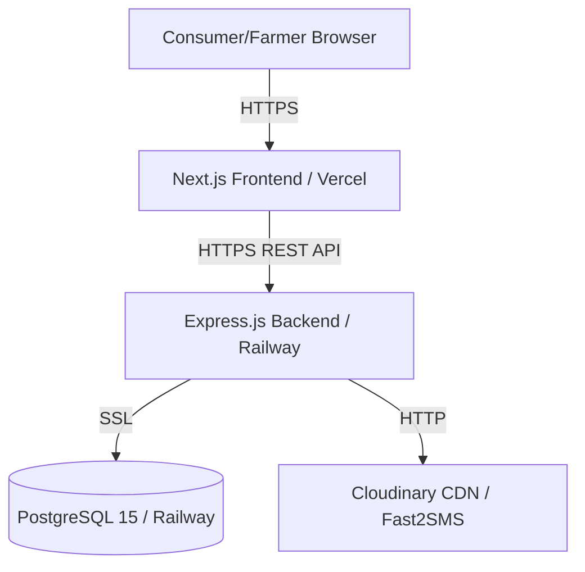

# Farm Connect — Final Technical Documentation
## IEEE Computer Society Bangalore Chapter Student Internship 2026
## Team P116 | April–September 2026

---

## Executive Summary

Farm Connect is a hyperlocal agricultural marketplace connecting farmers directly with nearby consumers in Karnataka, India. The platform eliminates traditional supply chain intermediaries (arthiyas, mandis) by enabling GPS-based product discovery, direct order placement, and cash-on-delivery fulfillment — all through a mobile-responsive web interface.

The team implemented a complete full-stack system across five weeks, achieving:
- GPS-based product discovery within 5–10km radius using the Haversine formula
- Complete order lifecycle from discovery through payment confirmation
- Cloudinary-based product image management
- Admin-controlled farmer verification workflow
- OTP-based phone authentication via Fast2SMS
- Production deployment on Railway (backend + database) and Vercel (frontend)

---

## Problem Statement

Indian agriculture employs approximately 58% of the population but contributes only 18.8% to GDP (Economic Survey 2023–24). Small and marginal farmers (86% of all Indian farmers) lose 30–40% of farm gate prices to intermediary layers in the APMC system.

Farm Connect addresses this by providing:
1. Direct farmer-to-consumer digital storefronts
2. Hyperlocal GPS filtering ensuring delivery feasibility
3. Simplified cash-on-delivery payment model removing gateway dependency
4. Phone OTP authentication reducing digital literacy barriers

---

## System Architecture

### Three-Tier Architecture

### Technology Decisions and Rationale

**PostgreSQL over MongoDB:**
Our data has strong relational requirements. Orders reference farmers and consumers with foreign key constraints. GPS distance calculations require SQL functions (`calculate_distance_km`). ACID transactions are essential for stock management. A Relational database was the correct choice.

**GPS Haversine over City-Based Filtering:**
Bengaluru spans 741 sq km. City-based filtering showed farmers 40km away as "nearby." GPS Haversine calculates actual surface distance accounting for Earth's curvature, making 5–10km radius filtering accurate and practically useful for same-day delivery.

**Cash on Delivery over Payment Gateway:**
Payment gateways require business registration, KYC, and bank account linking — impractical for small farmers. Cash on delivery matches existing farmer-consumer trust patterns and requires zero technical infrastructure beyond order status tracking.

**Cloudinary over Database BLOB Storage:**
Storing images in PostgreSQL bloats database size, slows queries, and provides no CDN. Cloudinary provides free-tier storage, automatic WebP conversion, and global CDN delivery. Application stores only the URL string (100 characters), not the image binary.

---

## Database Schema Summary

**Tables:** `farmers`, `consumers`, `products`, `orders`, `admins`, `otp_store`, `notifications`

**Custom Functions:** `calculate_distance_km(lat1, lon1, lat2, lon2)` — Haversine formula

**Key Design Decisions:**
- Orders store items as `JSONB` for schema flexibility without a separate `order_items` table.
- `verification_documents` stored as `JSONB` for flexible document type support.
- `payment_status` field in `orders` replaces a separate payments table (appropriate for MVP).
- Soft deletes (`is_active = FALSE`) preserve referential integrity and order history.
- 8 decimal places on coordinates provides ~1mm GPS precision (adequate for 10km scale).

---

## API Endpoints Summary

**Auth (Public):** `POST /auth/send-otp`, `POST /auth/verify-otp`
**Auth (Protected):** `GET /auth/me`

**Products (Public):** `GET /products`, `GET /products/:id`, `GET /products/search`, `GET /products/categories`, `GET /farmers/:id`

**Consumer (JWT + Role):** 
- `GET/POST/PATCH /consumer/profile`
- `GET /consumer/dashboard`
- `POST /consumer/orders`
- `GET /consumer/orders`
- `GET /consumer/orders/:id`
- `PATCH /consumer/orders/:id/cancel`

**Farmer (JWT + Role):**
- `GET/POST/PATCH /farmer/profile`
- `GET /farmer/dashboard`
- `GET /farmer/earnings`
- CRUD `/farmer/products`
- `PATCH /farmer/products/:id/stock`
- `GET /farmer/orders`
- `PATCH /farmer/orders/:id/{confirm,pack,deliver,complete,payment}`

**Admin (Admin JWT):** 
- `POST /admin/login`
- `GET /admin/analytics`
- `GET /admin/farmers`
- `PATCH /admin/farmers/:id/{verify,suspend,reinstate}`
- `GET /admin/consumers`
- `GET /admin/orders`

**System:** `GET /health`, `POST /upload/image`, `GET/PATCH /notifications`

---

## Weekly Implementation Summary

| Week | Focus | Key Deliverables |
|------|-------|-----------------|
| 1 | Foundation | Schema, Docker setup, seed data, basic auth backend |
| 2 | Core Flow | GPS Haversine, complete order lifecycle, stock transactions |
| 3 | User Lifecycle | Cloudinary, profile completion, admin verification, notifications |
| 4 | Enhancement | Dashboard stats, product search, order cancellation, rate limiting |
| 5 | Deployment | Railway + Vercel production, security hardening, documentation |

---

## Team Contributions

**Jagan Raju B — Database Architecture + Full Stack Integration (Team Lead)**
Database schema design and migrations, Haversine GPS implementation, transaction-safe order placement, Cloudinary integration service, dashboard analytics queries, integration testing, Railway database deployment, production migration.

**Deekshitha P — Backend API Development**
Express.js REST API implementation, JWT authentication, Fast2SMS OTP integration, Multer file upload middleware, admin panel APIs, rate limiting, global error handler, notification system, Railway backend deployment.

**Ishani Srinivas — Frontend Development**
Next.js 14 UI implementation, GPS location detection, AuthContext state management, farmer dashboard, admin panel, product management with image upload, shopping cart, order tracking timeline, Vercel deployment.

---

## Challenges and Solutions

**Challenge: GPS vs City Filtering (Mentor Feedback Week 1)**
Initial design used city-name filtering. Mentor highlighted that a city like Bengaluru spans 40km — not suitable for hyperlocal delivery. 
*Solution: Replaced with Haversine GPS formula stored as PostgreSQL function, calculating precise distance from consumer to farmer.*

**Challenge: Database Connection Error "failed to resolve host postgres"**
Backend team member's connection string used hostname 'postgres' from Docker internal network. 
*Solution: Established local-first development pattern — each developer runs own Docker PostgreSQL instance using shared schema.sql from Git repository.*

**Challenge: Stock Race Conditions**
Two concurrent consumers ordering the last unit of a product could both succeed, causing negative stock. 
*Solution: PostgreSQL transactions with `SELECT FOR UPDATE` row-level locking ensure atomic stock validation and reduction.*

---

## Deployment Instructions

**Prerequisites:** Railway account, Vercel account, Cloudinary account, Fast2SMS account

1. Fork repository from GitHub
2. Create Railway project, provision PostgreSQL
3. Run `production_migration.sql` against Railway database
4. Deploy backend to Railway with environment variables
5. Deploy frontend to Vercel with `NEXT_PUBLIC_API_URL` set to Railway backend URL
6. Verify health endpoint responds at `/health`

---

## Future Enhancements (Phase 2)

1. Kannada language support for farmer-facing interfaces
2. UPI payment gateway integration (Razorpay or PhonePe)
3. SMS order status notifications to consumers
4. Farmer earnings settlement reports (weekly PDF via email)
5. Consumer review and rating system
6. Demand forecasting based on order history
7. Multi-vendor cart (single order from multiple farmers)

---

*Submitted as partial fulfillment of IEEE Computer Society Bangalore Chapter Student Internship 2026 | Team P116*
*Faculty Mentor: Dr. Narender M.*
*Institute: The National Institute of Engineering, Mysuru (VTU Belagavi)*
