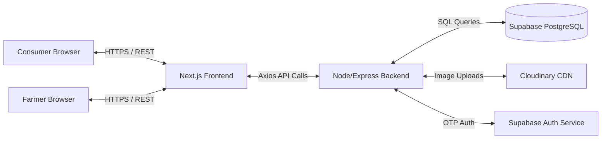

# 🌾 Farm Connect

**A Direct Farmer-to-Consumer Agricultural Marketplace**

Farm Connect is a full-stack web application designed to bridge the gap between local farmers and consumers. By bypassing traditional supply-chain intermediaries, the platform empowers farmers to list their agricultural products directly to nearby buyers, while enabling consumers to discover fresh, locally-sourced produce using proximity-based search and interactive mapping.

---

## 📖 Table of Contents

- [Project Overview](#project-overview)
- [Problem Statement & Objectives](#problem-statement--objectives)
- [Key Features](#key-features)
- [Complete System Workflow](#complete-system-workflow)
- [Product Discovery & Search](#product-discovery--search)
- [Location, Proximity & Map Functionality](#location-proximity--map-functionality)
- [System Architecture](#system-architecture)
- [Technology Stack](#technology-stack)
- [Database Architecture](#database-architecture)
- [API Architecture](#api-architecture)
- [Authentication & Security](#authentication--security)
- [Repository Structure](#repository-structure)
- [Git & GitHub Development Workflow](#git--github-development-workflow)
- [Local Development Setup](#local-development-setup)
- [Production Deployment Architecture](#production-deployment-architecture)
- [Production Verification Status](#production-verification-status)
- [Production Hardening & Engineering Improvements](#production-hardening--engineering-improvements)
- [Project Scope (Current vs Future)](#project-scope-current-vs-future)
- [Project Information & Contributing](#project-information--contributing)

---

## 🎯 Project Overview

Developed as a comprehensive 6-month internship project in collaboration with the **IEEE Computer Society** and **IamPro**, Farm Connect serves as a secure digital storefront for farmers to manage their inventory and orders natively.

## 💡 Problem Statement & Objectives

### Problem Statement
Traditional agricultural supply chains rely heavily on intermediaries, inflating prices for consumers while minimizing profit margins for the farmers who cultivate the produce. Additionally, consumers lack a direct, reliable way to discover and purchase fresh produce from local growers in their immediate vicinity.

### Project Objectives
1. Facilitate **direct interaction** and commerce between agricultural producers and consumers.
2. Utilize **geographic proximity** to highlight local produce.
3. Provide a secure, easy-to-use digital storefront for farmers to manage inventory and fulfill orders.

---

## 🚀 Key Features

- **OTP-Based Authentication**: Passwordless SMS login via Supabase.
- **Role-Based Access Control**: Interfaces for Consumers, Farmers, and Administrators.
- **Proximity Discovery**: Geographic matching using Haversine distance calculations.
- **Interactive Mapping**: Visual geographic representation of nearby farmers/products.
- **Real-time Inventory Management**: Stock validation preventing overselling.
- **Dynamic Marketplace**: Backend-driven search and filtering.
- **Secure Checkout**: Cart aggregation and robust order placement API.
- **Cloud Image Storage**: Direct integration with Cloudinary for product image uploads.

---

## 🔄 Complete System Workflow

### Consumer Workflow
1. **Authentication**: Consumer logs in securely via SMS OTP.
2. **Discovery**: Lands on the Marketplace, where products are dynamically fetched and sorted by distance.
3. **Product Details**: Views comprehensive product details, stock availability, and farmer locality.
4. **Cart Operations**: Adds items to the cart; the system validates available stock dynamically.
5. **Checkout & Ordering**: Consumer reviews the cart, verifies delivery details, and submits the order directly to the specific farmer.

### Farmer Workflow
1. **Authentication**: Farmer logs in via SMS OTP.
2. **Dashboard**: Views a high-level overview of sales, active orders, and low-stock alerts.
3. **Product Management**: Adds new agricultural products, sets pricing, defines stock levels, and uploads real product images (via Cloudinary).
4. **Order Processing**: Receives incoming orders from local consumers and updates statuses (Pending → Accepted → Delivered).

### Admin Workflow
1. **Dashboard**: Admin accesses a protected platform analytics dashboard.
2. **Analytics**: Reviews platform-wide metrics, user growth, and overarching transaction volumes.

---

## 🔍 Product Discovery & Search

Farm Connect implements a centralized, backend-driven search architecture. 
Consumers can discover products via the `/marketplace` UI, which communicates with the backend `GET /api/v1/products` endpoint. 
This endpoint natively supports unified query parameters (e.g., `?search=tomato&category=vegetables`), ensuring robust filtering by keywords, categories, and organic status without relying on obsolete or duplicated API routes.

---

## 📍 Location, Proximity & Map Functionality

Farm Connect relies heavily on hyper-local discovery utilizing **geographic coordinates (latitude/longitude)**.

- **Haversine Distance Calculation**: When a consumer accesses the marketplace, their local coordinates are passed to the backend. The PostgreSQL database utilizes the Haversine formula to calculate the direct "as-the-crow-flies" distance between the consumer and registered farmers.
- **Interactive Map**: The frontend leverages map components to visually plot nearby farmers, dynamically labeling products with precise distance indicators (e.g., "4.2 km away") to encourage local purchasing.

---

## 🏗️ System Architecture



---

## 💻 Technology Stack

### Frontend
- **Framework**: Next.js (React)
- **Styling**: Tailwind CSS
- **State Management**: React Context API
- **HTTP Client**: Axios
- **Icons**: Lucide React

### Backend
- **Runtime**: Node.js
- **Framework**: Express.js
- **Middleware**: Helmet (Security), CORS, Express Rate Limit
- **File Parsing**: Multer

### Database & Auth
- **Database**: PostgreSQL (Hosted on Supabase)
- **Authentication**: Supabase Auth (OTP)
- **Database Driver**: `pg`

### Storage
- **Image Hosting**: Cloudinary

### Deployment
- **Frontend Hosting**: Vercel
- **Backend Hosting**: Render

---

## 🗄️ Database Architecture

The core relational entities hosted on PostgreSQL include:

- **Users**: Identity table linking to Supabase Auth. Stores roles (consumer, farmer, admin).
- **Farmers**: Extended profile including exact latitude/longitude.
- **Consumers**: Extended profile including delivery preferences.
- **Products**: Marketplace inventory linked to a `farmer_id`. Tracks price, category, `stock_available`, and image URLs.
- **Orders**: Transactional records bridging a Consumer and a Farmer.
- **Order Items**: Line items inside an order, locking historical price/quantity.

**Core Relationships:**
- `Farmer (1) → (N) Products`
- `Consumer (1) → (N) Orders`
- `Farmer (1) → (N) Orders`
- `Order (1) → (N) Order Items`

---

## 🔌 API Architecture

Below are the primary functional groupings for the Express REST API:

### Authentication (`/api/v1/auth`)
- `POST /send-otp` - Triggers SMS OTP via Supabase.
- `POST /verify-otp` - Validates OTP and returns JWT sessions.

### Products (`/api/v1/products`)
- `GET /` - Retrieves the marketplace feed (supports query parameters).
- `GET /:id` - Retrieves detailed information for a specific product.

### Farmers (`/api/v1/farmers`)
- `GET /nearby` - Returns farmers within a calculated Haversine radius.
- `GET /products` - Retrieves all products owned by the authenticated farmer.
- `POST /products` - Creates a new product listing (Cloudinary integration).
- `GET /dashboard` - Aggregates active sales and stock alerts.
- `GET /orders` - Retrieves incoming consumer orders.

### Cart & Checkout (`/api/v1/orders`)
- `POST /place` - Validates stock, calculates totals, and generates a new order record.

---

## 🛡️ Authentication & Security

Farm Connect implements robust, production-ready security layers:

- **OTP Authentication**: Bypasses traditional passwords to prevent credential stuffing.
- **Role-Based Access Control (RBAC)**: Backend middleware strictly enforces roles (`requireRole('farmer')`).
- **Security Headers**: Implemented via `Helmet.js`, strictly defining cross-origin resource policies.
- **CORS**: Explicitly configured to accept requests only from the verified Vercel frontend.
- **Rate Limiting**: `express-rate-limit` prevents API abuse (e.g., OTP spam).
- **Proxy Trust**: Configured `trust proxy = 1` for Render compatibility to ensure rate limiters accurately identify client IPs behind load balancers.
- **Stock Validation**: Transactional backend verification ensures a product cannot be oversold.

---

## 📁 Repository Structure

```text
farm-connect/
├── frontend/
│   ├── src/
│   │   ├── app/            # Next.js App Router (Pages & Layouts)
│   │   ├── components/     # Reusable UI components (Product Cards, Modals)
│   │   ├── context/        # React Context (Cart state)
│   │   ├── hooks/          # Custom hooks (Geolocation)
│   │   └── lib/            # Axios interceptors & API wrappers
│   ├── public/             # Static fallback images & icons
│   └── next.config.ts      # Remote image patterns & build config
├── backend/
│   ├── src/
│   │   ├── controllers/    # Request handling logic
│   │   ├── middleware/     # Auth, Roles, CORS, Helmet
│   │   ├── routes/         # Express API route definitions
│   │   ├── services/       # Core business logic & DB queries
│   │   └── app.js          # Express application entry point
│   └── package.json        # Node.js dependencies
└── README.md
```

---

## 🌿 Git & GitHub Development Workflow

Development follows a structured approach ensuring production stability:

1. **Feature Development**: Enhancements and fixes are developed locally on feature branches.
2. **Main Branch**: The `main` branch serves as the source of truth for production. Code is merged into `main` only after local verification.
3. **Continuous Deployment**: Pushes to `main` automatically trigger CI/CD pipelines for frontend (Vercel) and backend (Render).

---

## ⚙️ Local Development Setup

### 1. Environment Variables
Create a `.env` file in the **backend** directory:
```env
PORT=5000
DATABASE_URL=your_supabase_postgresql_connection_string
SUPABASE_URL=your_supabase_project_url
SUPABASE_ANON_KEY=your_supabase_anon_key
JWT_SECRET=your_jwt_secret
CLOUDINARY_URL=your_cloudinary_url
```

Create a `.env.local` file in the **frontend** directory:
```env
NEXT_PUBLIC_API_URL=http://localhost:5000/api/v1
```

### 2. Backend Setup
```bash
cd backend
npm install
npm run dev
```

### 3. Frontend Setup
```bash
cd frontend
npm install
npm run dev
```

---

## ☁️ Production Deployment Architecture

```text
       [ End User ]
            |
            v
  (Vercel Edge Network)
    Frontend UI (Next.js)
            |
            v
    (Render Hosting)
   Backend API (Node.js)
     /             \
    v               v
(Supabase)     (Cloudinary)
PostgreSQL      Image CDN
   & Auth
```

---

## 🛠️ Production Hardening & Engineering Improvements

Farm Connect recently underwent a comprehensive stabilization pass focusing on production reliability:

- **API Contract Synchronization**: Unified data contracts across the stack to strictly enforce `camelCase` in the frontend API wrappers, decoupling it from the database's internal `snake_case` architecture.
- **Proxy Rate Limiter Configuration**: Corrected Express `trust proxy` settings to accurately evaluate client IPs behind Render's load balancers, fixing false-positive CORS/Rate-Limit loops during OTP authentication.
- **Next.js Image Whitelisting**: Hardened the `next.config.ts` remote patterns to explicitly permit trusted image sources (Cloudinary, Unsplash).
- **Bulletproof Image Fallbacks**: Implemented deterministic hashing for local fallback images and resolved infinite `onError` loops to ensure broken API links never result in a broken UI experience.
- **Search API Optimization**: Deprecated legacy standalone search endpoints in favor of unified query-parameter architectures (`/products?search=...`).

---

## ✅ Production Verification Status

The current `main` branch has successfully passed end-to-end production smoke testing.

| Functional Area      | Status |
| -------------------- | ------ |
| **Authentication**   | Verified |
| **Marketplace**      | Verified |
| **Product Details**  | Verified |
| **Images & Fallbacks**| Verified |
| **Cart Operations**  | Verified |
| **Stock Validation** | Verified |
| **Secure Checkout**  | Verified |
| **Order Processing** | Verified |
| **Proximity Search** | Verified |
| **Location / Map**   | Verified |
| **Admin Analytics**  | Verified |
| **Frontend Deploy**  | Verified (Vercel) |
| **Backend Deploy**   | Verified (Render) |

---

## 🔮 Project Scope (Current vs Future)

### Currently Implemented Functionality
Farm Connect successfully acts as an end-to-end minimum viable marketplace. It securely authenticates users, allows farmers to digitize their inventory via cloud uploads, enables consumers to locate hyper-local produce using Haversine mapping, and securely manages the transaction workflow.

### Future Enhancements (Out of Scope for V1)
- **Payment Gateway Integration**: Transitioning from conceptual orders to digital payments (e.g., Stripe/Razorpay).
- **Advanced Logistics**: Real-time delivery tracking and driver roles.
- **Native Mobile Application**: Migrating the web experience to React Native for field-use by farmers.
- **Advanced Recommendation AI**: Suggesting seasonal produce based on consumer purchase history.

---

## 🎓 Project Information & Contributing

**Farm Connect**  
- **Domain**: Agricultural Technology (AgriTech) / E-Commerce  
- **Project Type**: 6-Month Internship Capstone Project  
- **Affiliation**: IEEE Computer Society & IamPro  


### License
This project is developed for academic/internship purposes. See repository metadata for licensing details if applicable.
